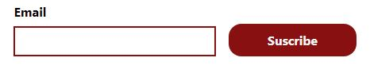

# Substack form Web Component's Guide

This Web Component helps you to create a form to manage your Substack subscriptions on your website. This component was based on the [Custom Substack Embed](https://substackapi.com/), I decided to create this component as a more agnostic and progressive enhancement-friendly alternative.

- 8 Kb minified
- Handles different state messages.
- Customizable styles with CSS Custom Properties.
- Completely responsive without using media queries.

## Setup

### Custom element’s settings

To add this form to your website, you need to add this script and then call the custom element `<substack-form>` to your website. This element receives five attributes:

- `domain`: this is your Substack's newsletter domain. **Always write it with a `/` at the end**.
- `max-width`: form’s max width. It accepts any CSS unit.
- `button-width`: form’s button’s max-width. It accepts any CSS unit.
- `input`: input’s label.
- `submit`: submit button’s label.

```html
<substack-form
  domain="example.substack.com/"
  max-width="50ch"
  button-width="12rem"
  input="E-mail"
  submit="Suscribe"
>
</substack-form>
```

### Script settings

Those settings will control the error and success messages. To change them go to `substackForm.js` and change those attributes in the `SubstackForm` class constructor:

- `this.ErrorSvg`: Adds an SVG to identify an error.
- `this.emailErrorMessage`: A message error in case the user adds an invalid email or the input field is empty at the moment of submitting the form.
- `this.processErrorMessage`: A message error in case something is wrong on Substack’s side.
- `this.successSvg`: Adds an SVG to identify whether the subscription process was successful.
- `this.successMessage`: The message is shown when the subscription process was successful. By default, this field is empty in the constructor, but it’s shown as:
  > Thanks for subscribing! We have sent you an email to `[user’s email]` to complete the process.

## Styling

<figure>
  
  <figcaption>Form’s default style</figcaption>
</figure>

You can use custom properties to change the form’s styles. You can add those properties on your stylesheet to change its styles

| Custom property           | What does it modify?                                                                            | Default value |
| ------------------------- | ----------------------------------------------------------------------------------------------- | ------------- |
| `--substack-brand`        | Input’s border color, Submit button’s background and input and submit button’s focus ring color | `#881010`     |
| `--substack-button-text`  | submit button’s text color                                                                      | `#f5f5f5`     |
| `--substack-success-bg`   | Success message’s background color                                                              | `#bbf7c7`     |
| `--substack-success-text` | Success message’s SVG and text color                                                            | `#0d7221`     |
| `--substack-error-bg`     | Error message’s background color                                                                | `#fce8e8`     |
| `--substack-error-text`   | Error message’s SVG and text’s color                                                            | `#720d0d`     |

## Progressive enhancement

It is possible to make this form works in case JavaScript fails to load. Keep in mind there is no known alternative to manage success or error messages because this endpoint doesn’t manage redirects for those cases.

To cover those cases, you can add the form inside the `<substack-form` custom element as follow:

```html
<substack-form
  domain="example.substack.com/"
  max-width="50ch"
  button-width="12rem"
  input="E-mail"
  submit="Suscribe"
>
  <form
    action="https://us-central1-substackapi.cloudfunctions.net/subscribe"
    method="POST"
  >
    <label class="label" for="newsletterEmail">E-mail:</label>
    <input
      class="input"
      type="email"
      id="newsletterEmail"
      name="email"
      required
    />
    <label for="newsletterDomain" hidden>Domain:</label>
    <input
      type="text"
      id="newsletterDomain"
      name="domain"
      value="example.substack.com/"
      hidden
    />
    <button class="submit" type="submit">Suscribe</button>
  </form>
</substack-form>
```

- The attributes `action` and `method` of this form are required to send the information to the API. **Don’t change them**
- The `email` and `domain` inputs are required to have the `name` attributes as you can notice in this code snippet.
- The only value you need to modify is the attribute `value` in the `input` with the name `domain` with your Substack’s newsletter domain. This input is hidden to all users by using the attribute `hidden`.
